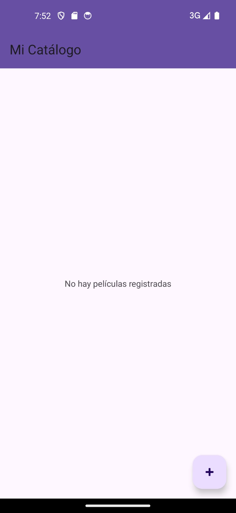
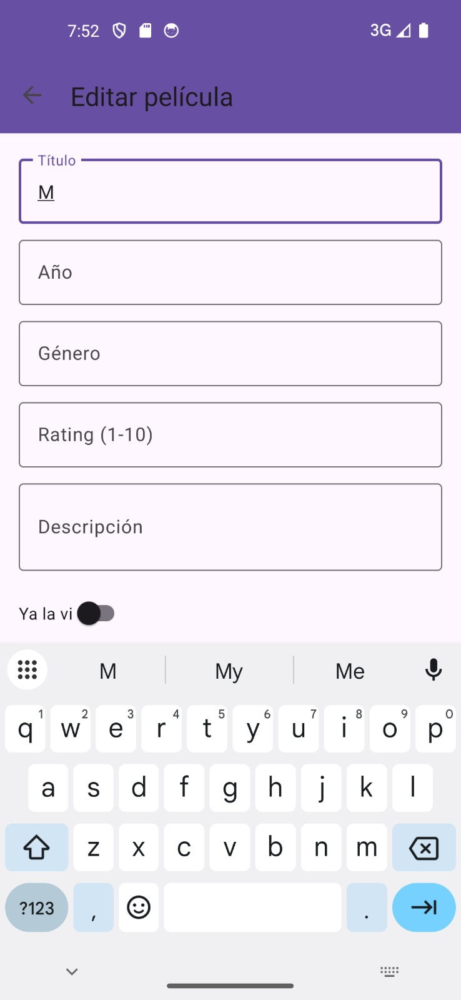
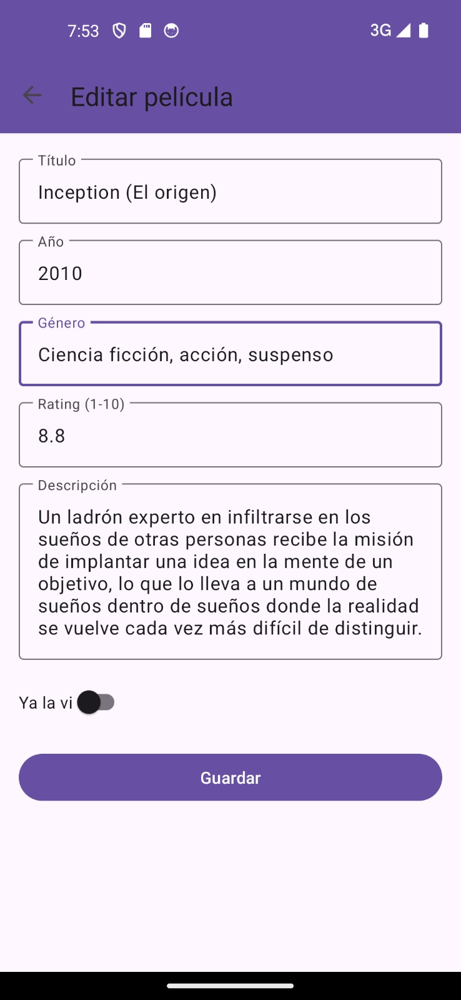
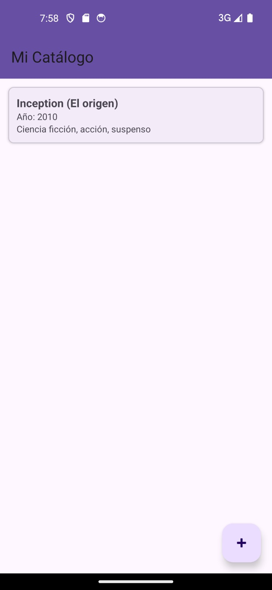
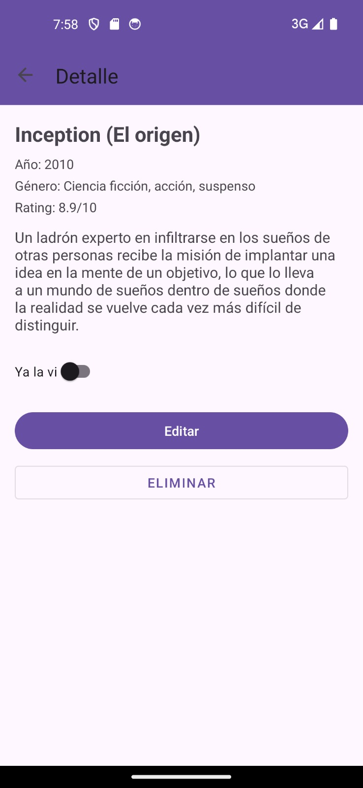
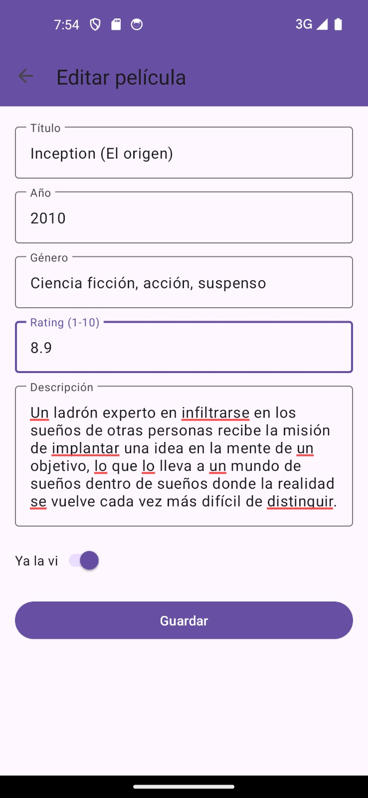
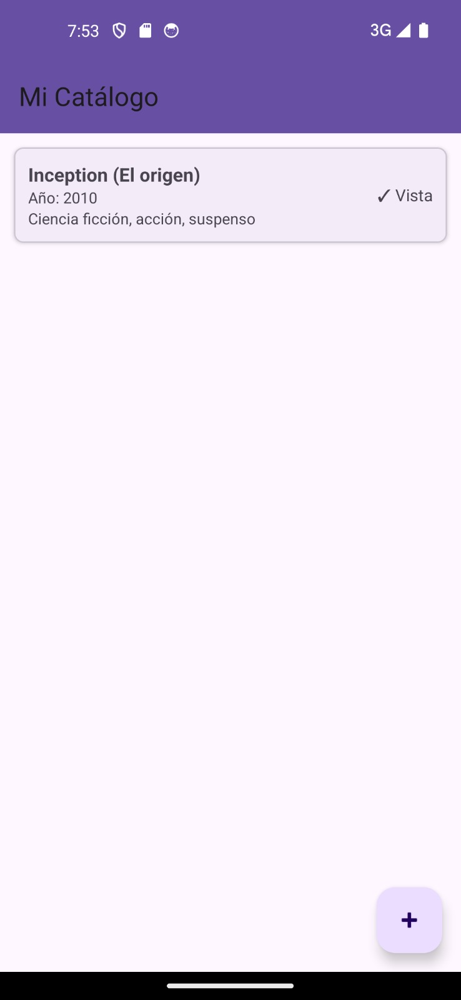
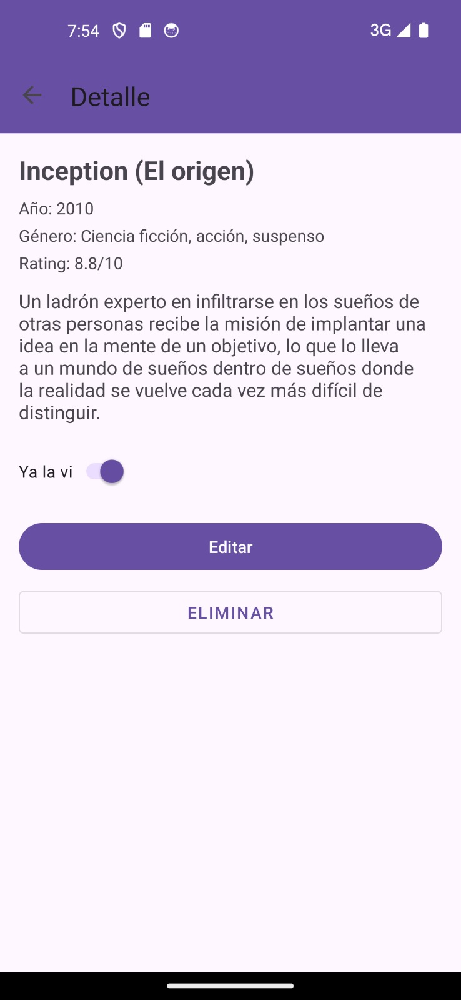

# MovieLibrary

**Taller Práctico 4 — Aplicaciones Móviles**  
Arquitectura MVVM con Navigation Component, Safe Args, LiveData y Room
## Integrantes

- Michael Alberto Romero Gonzalez - 100487913
- Sergio Rodríguez - 1098820679
- Anderson Sanguino Suarez - 1005538900
- Marlon Andres Ramirez Chirivi - 1095950857


- Fecha: 20/03/2026

---

## Descripción

MovieLibrary es una aplicación Android para gestionar un catálogo personal de películas.
Permite registrar, editar, eliminar y marcar películas como vistas, todo almacenado
localmente mediante una base de datos Room.

---

## Funcionalidades

- Ver la lista completa de películas registradas
- Agregar una nueva película con título, año, género, rating, descripción e indicador de vista
- Ver el detalle completo de cada película
- Marcar o desmarcar una película como vista
- Editar los datos de una película existente
- Eliminar una película del catálogo
- Navegación con botón de retroceso en todas las pantallas
- Mensaje informativo cuando no hay películas registradas

---

## Arquitectura

El proyecto implementa el patrón **MVVM (Model - View - ViewModel)** con las
siguientes capas:

```
UI (Fragments)
↓ observa LiveData
ViewModel
↓ llama funciones
Repository
↓ accede vía DAO
Room (SQLite local)
```

---


## Tecnologías y dependencias

| Tecnología | Uso |
|---|---|
| **Room** | Base de datos local SQLite |
| **LiveData** | Actualización reactiva de la UI |
| **ViewModel** | Mantener estado ante rotaciones |
| **Navigation Component** | Navegación entre fragments |
| **Safe Args** | Paso de argumentos tipado entre fragments |
| **ViewBinding** | Acceso seguro a vistas |
| **Coroutines** | Operaciones de escritura en hilo de fondo |

---


## Flujo Bundle → Safe Args

El taller requería implementar primero el paso de argumentos con **Bundle manual**
para comprender los riesgos (sin verificación de tipos, errores en tiempo de ejecución),
y luego migrar a **Safe Args**, que genera clases tipadas automáticamente desde el
`nav_graph.xml`, eliminando errores en tiempo de compilación.

---

## Modelo de datos

| Campo | Tipo | Descripción |
|---|---|---|
| `id` | Int | Identificador único (autoGenerado) |
| `title` | String | Título de la película |
| `year` | Int | Año de estreno |
| `genre` | String | Género principal |
| `rating` | Float | Calificación del 1 al 10 |
| `description` | String | Descripción o sinopsis |
| `watched` | Boolean | Si la película ya fue vista |

---


## Notas

- La app no requiere conexión a internet — todo es local con Room
- Los datos persisten al cerrar y reabrir la app
- La UI se actualiza automáticamente gracias a LiveData sin necesidad de recargar manualmente


## Capturas de pantalla








